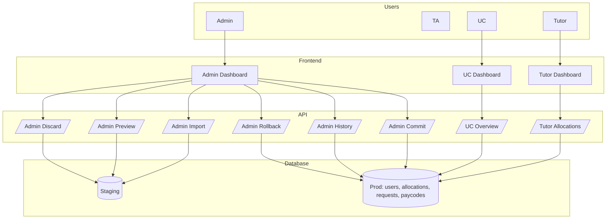

```mermaid
flowchart TD
  subgraph Users
    Tutor
    TA
    UC
    Admin
  end
  subgraph Frontend
    TutorUI[Tutor Dashboard]
    UCUI[UC Dashboard]
    AdminUI[Admin Dashboard]
  end
  subgraph API
    TAPI[/Tutor Allocations/]
    UCAPI[/UC Overview/]
    AIMP[/Admin Import/]
    APREV[/Admin Preview/]
    ACOMMIT[/Admin Commit/]
    ADISC[/Admin Discard/]
    AHIST[/Admin History/]
    ARB[/Admin Rollback/]
  end
  subgraph Database
    STG[(Staging)]
    PROD[(Prod: users, allocations, requests, paycodes)]
  end
  Tutor --> TutorUI --> TAPI --> PROD
  UC --> UCUI --> UCAPI --> PROD
  Admin --> AdminUI
  AdminUI --> AIMP --> STG
  AdminUI --> APREV --> STG
  AdminUI --> ACOMMIT --> PROD
  AdminUI --> ADISC --> STG
  AdminUI --> AHIST --> PROD
  AdminUI --> ARB --> PROD
```